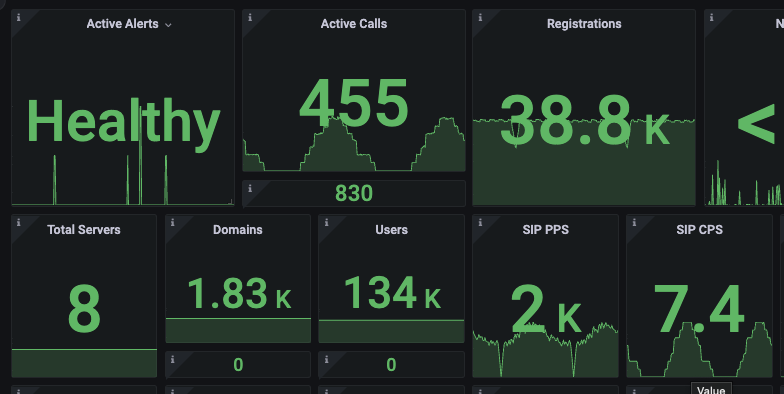
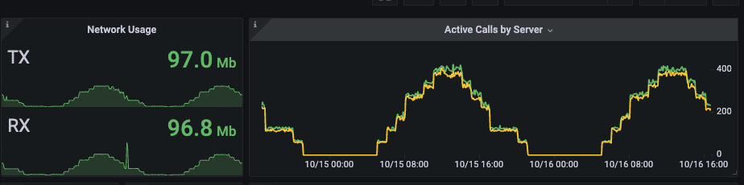
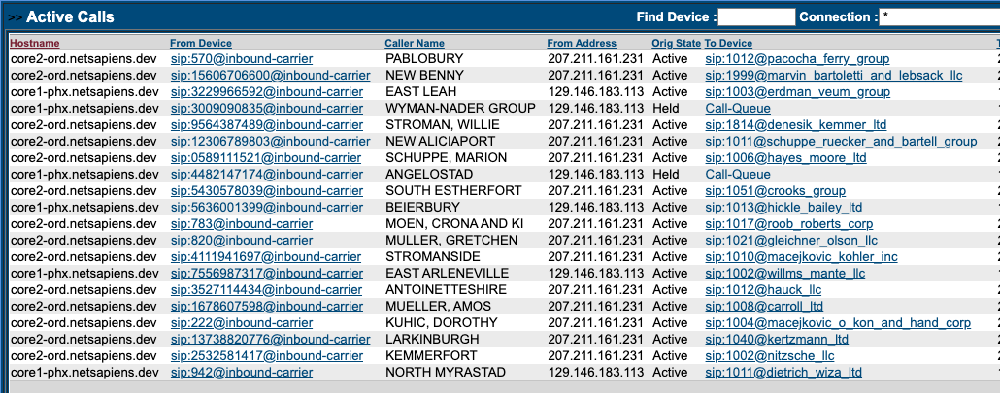
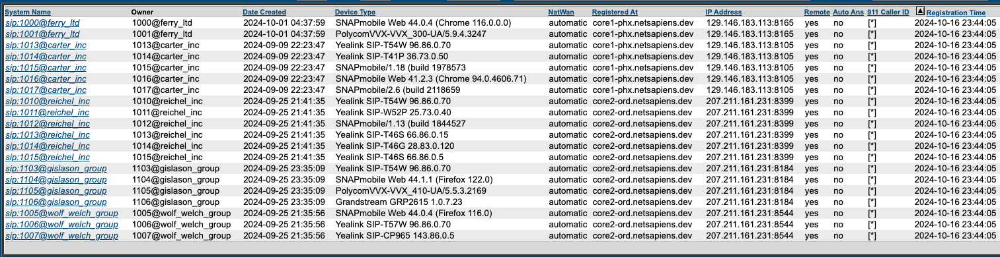

# netsapiens-loadgenerator

## Overview
This set of tools is designed to help generatate a batch of domains with users, devices, macs, queues, and agents against a netsapeins solution. It utilizes api v2 for all API calls and is a good example application for learning that api. The Tool will also help generate .csv files for input into SIPp scripts that are included with the pacakge. Finally it uses a series of bash scrips and cron jobs (yes, slightly old school) to run it all in the background and keep things going to your target server.

## Usage 
You should run 1 server per target SiPbx servers. Can be run anywhere that can access SiPbx SIP enpoint and Api. Note there is network usage so beware of hidden costs there. 

### Installation

Follow steps below to install and configure tool. 

### Prerequistes
* Ubuntu 22 or 24
* Packages
    * apt install git dnsutils cron rsync nodejs npm memcached vim sip-tester iputils-ping 2to3 python-is-python3

### Steps

* Clone Git Project to /usr/local/NetSapiens/ folder
    * mkdir -p /usr/local/NetSapiens/
    * cd /usr/local/NetSapiens/
    * git clone https://github.com/aaker/netsapiens-loadgenerator.git
    * cd /usr/local/NetSapiens/netsapiens-loadgenerator
* Install node packages. 
    * cd /usr/local/NetSapiens/netsapiens-loadgenerator
    * npm install 
* Setup Environment file with config. 
    * cp .env.example .env
    * use favorite editor to edit .env file.

### Recommended SIPbx System Settings. 
RTPRelayPrimeWithAudio = yes  #allows us to use "echo" function to test audio.
SipTransportRecovery = no    #prevents old data from hitting new sipp script unexpectidly. 

### Connection setting
natwan = sdp #set on connection accpeting traffic from sipp. allows us to use "echo" function to test audio.

### Example in use. 

* ~40k full registations
* \>1k domains, 100k+ users
* \>2k PPs, 10 Cps+

* Randon Domain, user and device user agents. 
* looks and simulates read user data. 

