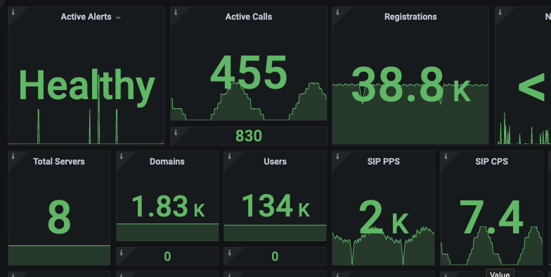
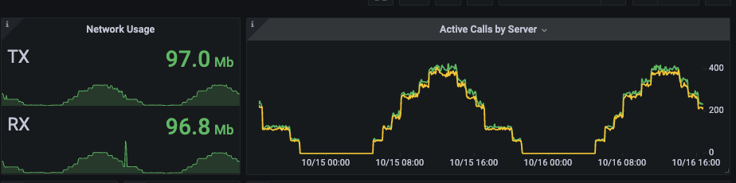
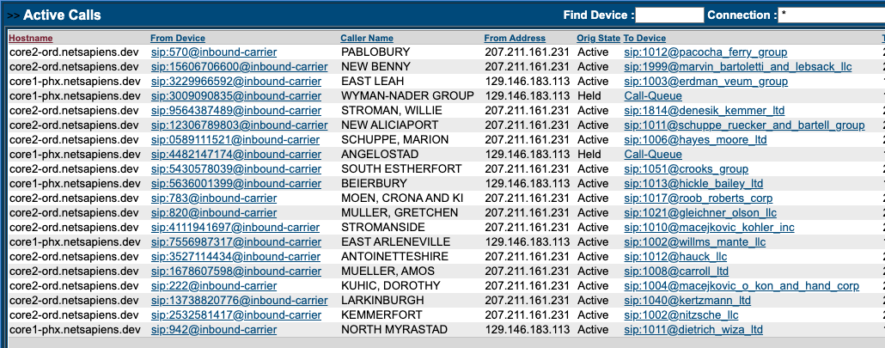
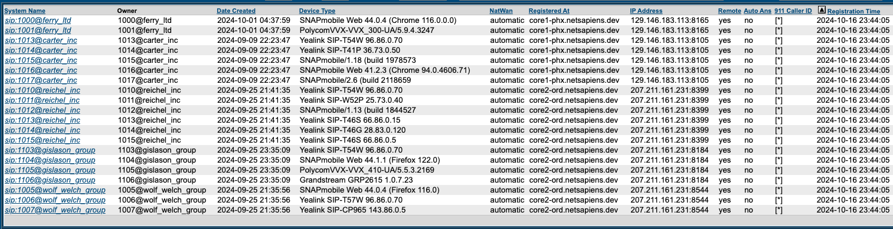
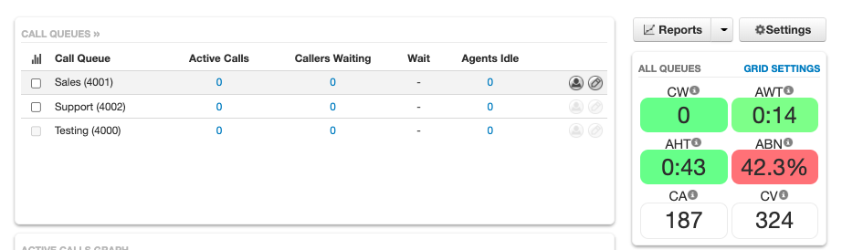
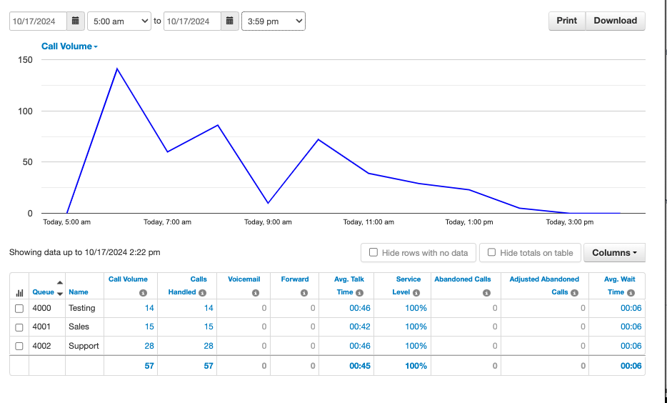
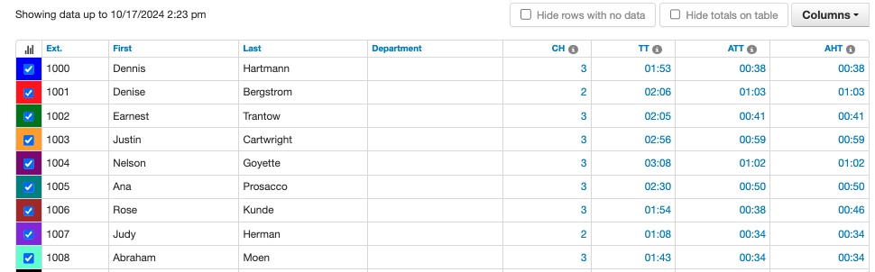

# netsapiens-loadgenerator

## Overview
This set of tools is designed to help generatate a batch of domains with users, devices, macs, queues, and agents against a netsapeins solution. It utilizes api v2 for all API calls and is a good example application for learning that api. The Tool will also help generate .csv files for input into SIPp scripts that are included with the pacakge. Finally it uses a series of bash scrips and cron jobs (yes, slightly old school) to run it all in the background and keep things going to your target server.

## Disclaimer

This application is unsupported by netsapiens/crexendo and is designed for a sample application, test tool and learning use case. Any support or advancement would be a community effort only with no warranties or SLAs provided by the original contributor or netsapiens. These are also real calls that will be tracked against any license or session limits.

## SIPP

This tool heavily uses sipp and is recommended to be compiled from source with TLS 

```bash
sudo apt update
sudo apt install -y build-essential cmake libssl-dev libpcap-dev libnet1-dev  libsctp-dev  libncurses5-dev pkg-config libpugixml-dev libgtest-dev
cd /usr/local/NetSapiens/
git clone https://github.com/SIPp/sipp.git
git fetch origin tag  v3.7.7
git checkout tags/v3.7.7
cd sipp
cmake . -DUSE_SSL=1 -DUSE_PCAP=1 -DBUILD_TESTING=OFF
make
ln -s /usr/local/NetSapiens/sipp/sipp /usr/bin/sipp
/usr/local/NetSapiens/netsapiens-loadgenerator/sipp/scripts/generate_tls_certs.sh
```


## Multi-Server Support

This tool now supports testing multiple target servers from a single installation! You can configure and manage load generation for multiple NetSapiens servers with:

- **Independent configuration** per server (SEED, maxDomains, peakCps, etc.)
- **Isolated CSV files** to prevent data conflicts
- **Automatic port management** to prevent conflicts when testing multiple servers simultaneously
- **Server-specific logging** for easier debugging

### Quick Start: Multi-Server Mode

1. **Create `servers.json`** configuration:
   ```bash
   cp servers.json.example servers.json
   # Edit servers.json with your server details
   ```

2. **Install `jq`** (required for multi-server mode):
   ```bash
   # Ubuntu/Debian
   sudo apt-get install jq

   # macOS
   brew install jq
   ```

3. **Generate data for a specific server**:
   ```bash
   node server.js --server prod1
   ```

4. **Run SIPp scripts**:
   ```bash
   # For a specific server
   sipp/scripts/register_all.sh --server prod1
   sipp/scripts/inbound.sh US_Eastern --server prod1

   # For ALL servers at once
   sipp/scripts/register_all.sh --server all
   sipp/scripts/inbound.sh US_Eastern --server all
   ```

### Legacy Single-Server Mode

Your existing setup continues to work without any changes! If you don't have a `servers.json` file, the system automatically uses your `.env` configuration:

```bash
# Works exactly as before
node server.js
sipp/scripts/register_all.sh
sipp/scripts/inbound.sh US_Eastern
```

### Running for All Servers at Once

You can run scripts for all configured servers with a single command using `--server all`:

```bash
# Register devices for all servers
sipp/scripts/register_all.sh --server all

# Run inbound calls for all servers (specific timezone)
sipp/scripts/inbound.sh US_Eastern --server all

# Generate data for all servers
# Note: Use a loop for this as server.js requires separate runs
for server in prod1 prod2 staging; do
  node server.js --server $server
done
```

**How it works:** 
- The script reads all server IDs from `servers.json`
- Loops through each server sequentially
- Calls itself recursively with each specific server ID
- Provides clear output showing progress for each server
- Continues even if one server fails (with a warning)

**Example output:**
```
==========================================
Running for ALL servers in servers.json
==========================================

>>> Starting registration for server: prod1
---
Multi-server mode: Using server 'prod1'
Target server: sas1.example.com
...
>>> Completed registration for server: prod1

>>> Starting registration for server: prod2
---
Multi-server mode: Using server 'prod2'
Target server: sas2.example.com
...
>>> Completed registration for server: prod2

==========================================
Finished running for all servers
==========================================
```

See [MIGRATION.md](MIGRATION.md) for detailed migration instructions and troubleshooting.

## Usage
You can run multiple target servers from a single installation (multi-server mode) or use the legacy single-server configuration. The tool can be run anywhere that can access the SIPbx SIP endpoint and API. Note there is network usage so beware of hidden costs if using a provider charging for network.

## Main User Generation logic
* Application will create up MAX_DOMAIN number of domains using a random name generation tool. The randomness is controlled by the SEED variable in the .env so repeated running will return similar names. 
* The tool is designed to create domains in random sizes, 1% of the domains will be > 1k users. 5% will be >100 and the remaining will be random between 30 and 80 users per domain. 
* Each domain will be randomly assinged at leasst 1 phonenumber, but up to 10 depending on the size of the domain. The Area code will be random and the last 4 numbers will be random as well. The NXX will be 555 to avoid overlap with real numbers.
* For each domain the tool will create N number of users with Random First & last name as well as putting the client in a Random site based on a random city name generated. Its 1 site per 30 users in the domain. 
* Extensions will start with 1000 and go up from there incrementing by 1. 1000 will get office manager, 1001 Call Center Supervisor Scope and the rest basic user scope. 
* Each User will get 1 device with a random secure password and 50% of those users will also get a MAC address addedd to the ndp. 
* The application will create a recording record for every X number of users. Configurable via RECORDING_DIVISER in .env. Example 4 woudl be 25% of the calls would get recorded. 
* Each domain will get at least 1 callqueue, but app will generate up to 8, 1 per every 10 users. Queue extensions will start with 4000 and go up from there. 
* Every queue will get agents added, at the rate of 10% of the users in the domain or a min of 4 per queue. The agents are selected at random. 

## Calling feautures Features
* Regististration including full auth (udp, tcp and tls). NOTE: TLS still in progress and will require addition sipp steps. 
* SIP SUBSCRIBE (MWI and Prsence) total of 5 per registration on average. 
* Agents in Callqueues capable of taking calls. 
* Inbound calls dispatched to call queues and agent through normal inbound connection, DID table, etc.. flow
* calling patterns mimic a 8 hour day acorss multiple time zones in the US.

## Installation

Follow steps below to install and configure tool. 

### Prerequistes
* Ubuntu 22 or 24
* x86_64 or Arm
* Packages
    ```
     apt install git dnsutils cron rsync nodejs npm memcached vim  iputils-ping 2to3 python-is-python3 bc
     ```

### Steps

* Clone Git Project to /usr/local/NetSapiens/ folder
    ```
    mkdir -p /usr/local/NetSapiens/
    cd /usr/local/NetSapiens/
    git clone https://github.com/aaker/netsapiens-loadgenerator.git
    cd /usr/local/NetSapiens/netsapiens-loadgenerator
    ```
* Install node packages. 
    ```
    cd /usr/local/NetSapiens/netsapiens-loadgenerator
    npm install 
    ```
* Link cron config file
    ```
    ln -sf /usr/local/NetSapiens/netsapiens-loadgenerator/cron/start_sipp  /etc/cron.d/start_sipp
    ```
* Setup Environment file with config. 
    ```
    cp .env.example .env
    ```
    * generate new API key with super user scope. Can limit to ip. https://docs.ns-api.com/docs/api-keys
    * use favorite editor to edit .env file. Set TARGET_SERVER and API_KEY 
* Start app building user and sipp scripts. 
     node server.js

### Upgrade steps
* Stash any changes to avoid conflicts and pull latest code.
    ```
     git stash; 
     git pull;
    ```
### Example .env file

```
TARGET_SERVER="ns-api.com" # Target server for API and SIP requests
RESELLER="NetSapiens" # Reseller name for API requests
SEED=123456 # Seed for random number generator, prefer 6 digit numberic
APIKEY="nss_xxxxx" # API Key for super user API KEY
MAX_DOMAIN=10 # the number of random domains that will be generated
PEAK_CPS=10 # Peak CPS for SIP traffic going to the target Server at peak time. can be small like .5 too.
REGISTRATION_PCT=0.5 # Percentage of USER DEVICES that will be registered
RECORDING_DIVISER=4 # 1/x the chance the user will have recording enabled. example 4 will be 25% recording enabled
API_DEBUG=1 # 0=off, 1=on
IP_USE_PUBLIC=1 # 0=off, 1=on Use public IP for SDP Ip address
```

Note: Changes to the .env file for rate CPS and REGISTRAION will take effect over the next hour of run time. those changes are not immidiate. 


### Recommended SIPbx System Settings. 
* RTPRelayPrimeWithAudio = yes  #allows us to use "echo" function to test audio.
* SipTransportRecovery = no    #prevents old data from hitting new sipp script unexpectidly. 

### Connection setting
Create a connection to match on "inbound-carrier" and lock to IP if needed. Send calls to "Inbound DID" or your normal inbound dial plan. 
* natwan = sdp #set on connection accpeting traffic from sipp. allows us to use "echo" function to test audio.

### Recommended Load Generator Host Tuning

When SIPp streams audio from PCAP (`play_pcap_audio`), packet rates climb fast and most of the kernel CPU shows up as `%soft` (NET_RX softirq), not `%irq`. The defaults on a typical cloud VM are too aggressive on interrupt frequency and too small on receive batching for sustained RTP load. The settings below noticeably reduce softirq load with no functional change — in practice they have reclaimed ~15 percentage points of CPU on an 8-core cloud VM under sustained call load.

Replace `ens3` with your interface name (check with `ip -br link`).

#### NIC tuning (ethtool)

```bash
# Coalescing: cap IRQs by batching packets at the NIC level.
# Cloud VMs often default to rx-usecs=8 with adaptive on, which is too
# fine-grained for sustained RTP. 200us is a reasonable starting point.
ethtool -C ens3 adaptive-rx off adaptive-tx off \
  rx-usecs 200 tx-usecs 200 rx-frames 128 tx-frames 128

# Bigger ring buffers absorb bursts without drops
ethtool -G ens3 rx 4096 tx 4096

# Generic Receive Offload (cheap win when supported)
ethtool -K ens3 gro on

# Maximize RX queues so RSS spreads softirq across all cores
ethtool -L ens3 combined $(ethtool -l ens3 | awk '/Combined:/{v=$2} END{print v}' | tail -1) 2>/dev/null || true
```

#### Kernel network knobs

Drop in `/etc/sysctl.d/99-sipp-loadgen.conf`:

```ini
# Larger NAPI batch — reduces "time_squeeze" (NAPI running out of budget)
net.core.netdev_budget = 600
net.core.netdev_budget_usecs = 8000
net.core.dev_weight = 128

# Backlog headroom for traffic spikes
net.core.netdev_max_backlog = 5000

# Socket buffers for higher concurrent call counts
net.core.rmem_max = 16777216
net.core.wmem_max = 16777216
net.core.rmem_default = 1048576
net.core.wmem_default = 1048576
```

Apply with `sysctl --system`.

#### Make NIC tuning persistent

`ethtool` settings do not survive reboot. To persist, drop in a systemd oneshot (edit `ens3` to your interface):

```bash
cat >/etc/systemd/system/nic-tune.service <<'EOF'
[Unit]
Description=NIC tuning for SIPp load generator
After=network-online.target
Wants=network-online.target

[Service]
Type=oneshot
ExecStart=/usr/sbin/ethtool -C ens3 adaptive-rx off adaptive-tx off rx-usecs 200 tx-usecs 200 rx-frames 128 tx-frames 128
ExecStart=/usr/sbin/ethtool -G ens3 rx 4096 tx 4096
ExecStart=/usr/sbin/ethtool -K ens3 gro on
RemainAfterExit=yes

[Install]
WantedBy=multi-user.target
EOF
systemctl daemon-reload
systemctl enable --now nic-tune.service
```

#### Verification

```bash
# %soft should drop a few points and stay evenly spread across cores
mpstat -P ALL 1 5

# Column 2 (dropped) must stay 0. Column 3 (time_squeeze) rate should slow.
cat /proc/net/softnet_stat
awk '{print strtonum("0x"$3)}' /proc/net/softnet_stat > /tmp/a; sleep 10
awk '{print strtonum("0x"$3)}' /proc/net/softnet_stat > /tmp/b
paste /tmp/a /tmp/b | awk '{printf "cpu%d  %d squeeze/sec\n",NR-1,($2-$1)/10}'

# Per-queue packet counts — flag if one RSS queue takes a disproportionate share
ethtool -S ens3 | grep -iE 'rx_queue_[0-9]+_packets|tx_queue_[0-9]+_packets'

# Confirm no NIC-level drops
ethtool -S ens3 | grep -iE 'drop|discard|miss|error|no_buf'
```

#### When tuning hits its limit

These knobs reclaim ~10-20% of softirq overhead at best. If `%soft` is still pinning the box at high call volumes, the only real levers are **fewer packets** (longer RTP ptime — 40ms halves packet rate vs 20ms — or fewer concurrent calls) or a larger instance. Kernel tuning does not conjure CPU.

### Example run

**Legacy Single-Server Mode:**
```
root@core1-phx:/usr/local/NetSapiens/netsapiens-loadgenerator# node server.js

======================================
Configuration Mode: single
Target Server: ns-api.com
Server ID: default
Max Domains: 10
Peak CPS: 10
Registration %: 80
SEED: 123456
======================================

[0]Creating domain o_conner_kuhic_inc with 29 users in US/Pacific timezone and area code 682 and main number 6825556045
[1]Creating domain oberbrunner_llc with 27 users in US/Mountain timezone and area code 213 and main number 2135555576
[2]Creating domain bogisich_group with 30 users in US/Central timezone and area code 576 and main number 5765557408
[3]Creating domain o_keefe_casper_llc with 42 users in US/Eastern timezone and area code 639 and main number 6395559513
[4]Creating domain bailey_jerde_and_jacobs_inc with 49 users in US/Alaska timezone and area code 492 and main number 4925555632
```

**Multi-Server Mode:**
```
root@core1-phx:/usr/local/NetSapiens/netsapiens-loadgenerator# node server.js --server prod1

======================================
Configuration Mode: multi
Target Server: sas1.example.com
Server ID: prod1
Max Domains: 50
Peak CPS: 10
Registration %: 80
SEED: 12345
======================================

[0]Creating domain acme_corp with 45 users in US/Pacific timezone and area code 415 and main number 4155556789
[1]Creating domain tech_solutions_llc with 38 users in US/Mountain timezone and area code 303 and main number 3035557890


# Legacy mode CSV output (sipp/csv/devices/):
root@core1-phx:/usr/local/NetSapiens/netsapiens-loadgenerator# head -n4 sipp/csv/devices/oberbrunner_llc.csv
SEQUENTIAL
Dan Ankunding;1001;oberbrunner_llc;[authentication username=1001 password=74d9be7f523f]
Edmund Kreiger;1000;oberbrunner_llc;[authentication username=1000 password=894abc3c87b9]
Hugo Koelpin;1007;oberbrunner_llc;[authentication username=1007 password=8912ccd20f76]

root@core1-phx:/usr/local/NetSapiens/netsapiens-loadgenerator# head -n4 sipp/csv/phonenumbers/US_Mountain.csv
RANDOM
12135555576;oberbrunner_llc;DID for Design
12135555577;oberbrunner_llc;DID for Development
12135555575;oberbrunner_llc;DID for Engineering

# Multi-server mode CSV output (sipp/csv/servers/prod1/devices/):
root@core1-phx:/usr/local/NetSapiens/netsapiens-loadgenerator# head -n4 sipp/csv/servers/prod1/devices/acme_corp.csv
SEQUENTIAL
John Smith;1000;acme_corp;[authentication username=1000 password=a1b2c3d4e5f6]
Jane Doe;1001;acme_corp;[authentication username=1001 password=f6e5d4c3b2a1]
Bob Johnson;1002;acme_corp;[authentication username=1002 password=123abc456def]

root@core1-phx:/usr/local/NetSapiens/netsapiens-loadgenerator# head -n4 sipp/csv/servers/prod1/phonenumbers/US_Pacific.csv
RANDOM
14155556789;acme_corp;DID for Sales
14155556790;acme_corp;DID for Support
14155556791;acme_corp;DID for Customer Service
```

### Example in use. 

* ~40k full registations
* \>1k domains, 100k+ users
* \>2k PPs, 10 Cps+


* Randon Domain, user and device user agents. 
* looks and simulates read user data. 


* you can even get call center stats





## Prometheus Metrics Monitoring

This tool includes a built-in metrics server that exposes SIPp response time statistics in Prometheus format. Track response times, percentiles, and performance metrics across all your load tests.

### Features

- **Response Time Tracking**: Both histogram (with percentiles) and summary metrics
- **Multi-Server Support**: Separate metrics per server when using servers.json configuration
- **Real-time Updates**: Continuously monitors SIPp statistics files
- **Prometheus Compatible**: Standard /metrics endpoint for Prometheus scraping
- **Multiple Metrics Types**:
  - `sipp_response_time_seconds` - Histogram with buckets (10ms to 5s)
  - `sipp_response_time_seconds_summary` - Summary with P50, P95, P99 quantiles
  - `sipp_response_time_average_seconds` - Average response time gauge
  - `sipp_response_time_p50_seconds` - P50 (median) gauge
  - `sipp_response_time_p95_seconds` - P95 gauge
  - `sipp_response_time_p99_seconds` - P99 gauge
  - `sipp_response_count_total` - Total response count

All metrics include labels: `{server="...", scenario="...", operation="..."}`

### Quick Start

1. **Install dependencies** (if not already installed):
   ```bash
   npm install
   ```

2. **Start the metrics server**:
   ```bash
   # Using npm script
   npm run metrics

   # Or directly
   node metrics-server.js

   # Or using the startup script
   ./scripts/start-metrics-server.sh start
   ```

3. **Access metrics**:
   - Prometheus endpoint: http://localhost:9090/metrics
   - Health check: http://localhost:9090/health
   - Server info: http://localhost:9090/

4. **Run your SIPp load tests** - metrics will automatically be collected from the SIPp statistics files.

### Configuration

Configure the metrics server using environment variables in your `.env` file:

```bash
# Metrics server configuration
METRICS_PORT=9090           # Port for metrics server (default: 9090)
STATS_DIR=./sipp/stats      # Directory for SIPp stats files (default: ./sipp/stats)
UPDATE_INTERVAL=5           # Update interval in seconds (default: 5)
```

### Using the Startup Script

The startup script provides easy management of the metrics server:

```bash
# Start the server
./scripts/start-metrics-server.sh start

# Check status
./scripts/start-metrics-server.sh status

# View logs
./scripts/start-metrics-server.sh logs

# Restart the server
./scripts/start-metrics-server.sh restart

# Stop the server
./scripts/start-metrics-server.sh stop
```

### Prometheus Configuration

Add this scrape config to your `prometheus.yml`:

```yaml
scrape_configs:
  - job_name: 'sipp-loadgen'
    static_configs:
      - targets: ['localhost:9090']
    scrape_interval: 15s
```

### Example Prometheus Queries

```promql
# P95 response time by server
sipp_response_time_p95_seconds{server="prod1"}

# Average response time across all servers
avg(sipp_response_time_average_seconds)

# Response count by scenario
sum by (scenario) (sipp_response_count_total)

# Histogram quantile (P95) from histogram data
histogram_quantile(0.95, rate(sipp_response_time_seconds_bucket[5m]))

# Summary quantile (P99)
sipp_response_time_seconds_summary{quantile="0.99"}
```

### Grafana Dashboard

You can create a Grafana dashboard with panels for:

1. **Response Time Over Time** (line chart)
   - Query: `sipp_response_time_p50_seconds`, `sipp_response_time_p95_seconds`, `sipp_response_time_p99_seconds`

2. **Response Time Distribution** (heatmap)
   - Query: `rate(sipp_response_time_seconds_bucket[5m])`

3. **Average Response Time by Server** (gauge)
   - Query: `sipp_response_time_average_seconds`

4. **Total Responses** (counter)
   - Query: `sipp_response_count_total`

5. **Active Stats Files** (gauge)
   - Query: `sipp_stats_files_active`

### How It Works

1. **SIPp Statistics**: The bash scripts automatically enable `-trace_stat` flag when running SIPp, generating CSV statistics files in `sipp/stats/`

2. **File Watching**: The metrics server uses `chokidar` to watch for new or modified stats files

3. **CSV Parsing**: When files change, the parser extracts response time distributions from SIPp's output

4. **Metrics Export**: Prometheus metrics are calculated and exposed at the `/metrics` endpoint

5. **Multi-Server**: When using `--server` flag, metrics are automatically labeled with the server ID

### Troubleshooting

**Metrics not updating:**
- Check that SIPp scripts are running: `ps aux | grep sipp`
- Verify stats files exist: `ls -la sipp/stats/`
- Check metrics server logs: `./scripts/start-metrics-server.sh logs`

**No stats files generated:**
- Ensure you've run the latest version of register.sh scripts
- Check that SIPp supports `-trace_stat` flag: `sipp -h | grep trace_stat`

**Port 9090 already in use:**
- Change `METRICS_PORT` in `.env` to a different port
- Or stop conflicting service: `sudo lsof -i :9090`

### Additional Tools 

## Socket Tester. 

Nodejs app to load generate socket.io clients to nsnode application.
Code in /sockettester 

## sipp "API" 

Simple php script to trigger sipp scripts via web requests. Used in automation tooling 

### Feature wish list
* additional call flows
  * extension to extension
  * call to voicemail
  * conference bridges
* api usage
  * read users
  * read reports
  * log in and log out agents
* ~~connect nsnode socket~~ (available now ith /sockettester app 
    
