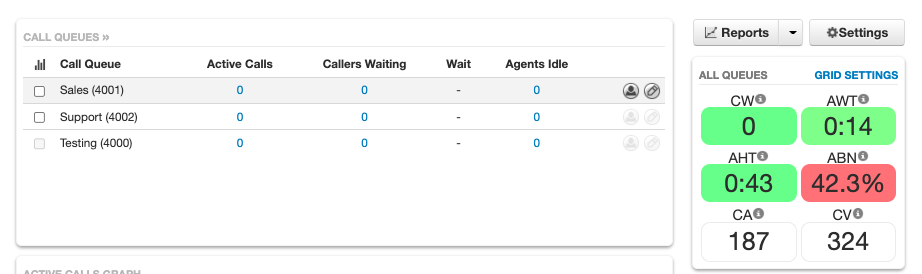
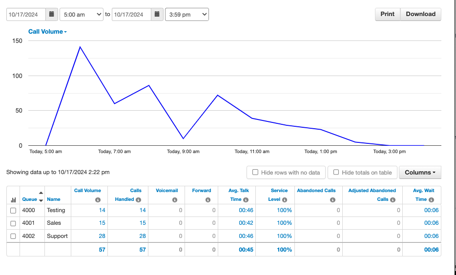

# netsapiens-loadgenerator

## Overview
This set of tools is designed to help generatate a batch of domains with users, devices, macs, queues, and agents against a netsapeins solution. It utilizes api v2 for all API calls and is a good example application for learning that api. The Tool will also help generate .csv files for input into SIPp scripts that are included with the pacakge. Finally it uses a series of bash scrips and cron jobs (yes, slightly old school) to run it all in the background and keep things going to your target server.

## Disclaimer

This application is unsupported by netsapiens/crexendo and is designed for a sample application, test tool and learning use case. Any support or advancement would be a community effort only with no warranties or SLAs provided by the original contributor or netsapiens. These are also real calls that will be tracked against any license or session limits. 

## Usage 
You should run 1 server per target SiPbx servers. Can be run anywhere that can access SiPbx SIP enpoint and Api. Note there is network usage so beware of hidden costs there if using a provider charging for network.

## Main User Generation logic
* Application will create up MAX_DOMAIN number of domains using a random name generation tool. The randomness is controlled by the SEED variable in the .env so repeated running will return similar names. 
* The tool is designed to create domains in random sizes, 1% of the domains will be > 1k users. 5% will be >100 and the remaining will be random between 30 and 80 users per domain. 
* Each domain will be randomly assinged at leasst 1 phonenumber, but up to 10 depending on the size of the domain. The Area code will be random and the last 4 numbers will be random as well. The NXX will be 555 to avoid overlap with real numbers.
* For each domain the tool will create N number of users with Random First & last name as well as putting the client in a Random site based on a random city name generated. Its 1 site per 30 users in the domain. 
* Extensions will start with 1000 and go up from there incrementing by 1. 1000 will get office manager, 1001 Call Center Supervisor Scope and the rest basic user scope. 
* Each User will get 1 device with a random secure password and 50% of those users will also get a MAC address addedd to the ndp. 
* The application will create a recording record for every X number of users. Configurable via RECORDING_DIVISER in .env. Example 4 woudl be 25% of the calls would get recorded. 
* Each domain will get at least 1 callqueue, but app will generate up to 8, 1 per every 10 users. Queue extensions will start with 4000 and go up from there. 
* Every queue will get agents added, at the rate of 10% of the users in the domain or a min of 4 per queue. The agents are selected at random. 

## Calling feautures Features
* Regististration including full auth (udp, tcp and tls). NOTE: TLS still in progress and will require addition sipp steps. 
* SIP SUBSCRIBE (MWI and Prsence) total of 5 per registration on average. 
* Agents in Callqueues capable of taking calls. 
* Inbound calls dispatched to call queues and agent through normal inbound connection, DID table, etc.. flow
* calling patterns mimic a 8 hour day acorss multiple time zones in the US.

### Installation

Follow steps below to install and configure tool. 

### Prerequistes
* Ubuntu 22 or 24
* x86_64 or Arm
* Packages
    ```
     apt install git dnsutils cron rsync nodejs npm memcached vim sip-tester iputils-ping 2to3 python-is-python3
     ```

### Steps

* Clone Git Project to /usr/local/NetSapiens/ folder
    ```
    mkdir -p /usr/local/NetSapiens/
    cd /usr/local/NetSapiens/
    git clone https://github.com/aaker/netsapiens-loadgenerator.git
    cd /usr/local/NetSapiens/netsapiens-loadgenerator
    ```
* Install node packages. 
    ```
    cd /usr/local/NetSapiens/netsapiens-loadgenerator
    npm install 
    ```
* Link cron config file
    ```
    ln -sf /usr/local/NetSapiens/netsapiens-loadgenerator/cron/start_sipp  /etc/cron.d/start_sipp
    ```
* Setup Environment file with config. 
    ```
    cp .env.example .env
    ```
    * generate new API key with super user scope. Can limit to ip. https://docs.ns-api.com/docs/api-keys
    * use favorite editor to edit .env file. Set TARGET_SERVER and API_KEY 
    * setup cert and key for tls.
    ```
    mkdir -p /usr/local/NetSapiens/netsapiens-loadgenerator/certs
    openssl req -x509 -newkey rsa:4096 -keyout /usr/local/NetSapiens/netsapiens-loadgenerator/certs/key.pem -out /usr/local/NetSapiens/netsapiens-loadgenerator/certs/cert.pem -days 4096 -nodes -subj "/CN=localhost"
    ```
* Start app building user and sipp scripts. 
     node server.js

### Upgrade steps
* Stash any changes to avoid conflicts and pull latest code.
    ```
     git stash; 
     git pull;
    ```
### Example .env file

```
TARGET_SERVER="ns-api.com" # Target server for API and SIP requests
RESELLER="NetSapiens" # Reseller name for API requests
SEED=123456 # Seed for random number generator, prefer 6 digit numberic
APIKEY="nss_xxxxx" # API Key for super user API KEY
MAX_DOMAIN=10 # the number of random domains that will be generated
PEAK_CPS=10 # Peak CPS for SIP traffic going to the target Server at peak time. can be small like .5 too.
REGISTRATION_PCT=0.5 # Percentage of USER DEVICES that will be registered
RECORDING_DIVISER=4 # 1/x the chance the user will have recording enabled. example 4 will be 25% recording enabled
API_DEBUG=1 # 0=off, 1=on
IP_USE_PUBLIC=1 # 0=off, 1=on Use public IP for SDP Ip address
```


### Recommended SIPbx System Settings. 
* RTPRelayPrimeWithAudio = yes  #allows us to use "echo" function to test audio.
* SipTransportRecovery = no    #prevents old data from hitting new sipp script unexpectidly. 

### Connection setting
Create a connection to match on "inbound-carrier" and lock to IP if needed. Send calls to "Inbound DID" or your normal inbound dial plan. 
* natwan = sdp #set on connection accpeting traffic from sipp. allows us to use "echo" function to test audio.

### Example run
```
root@core1-phx:/usr/local/NetSapiens/netsapiens-loadgenerator# node server.js 
[0]Creating domain o_conner_kuhic_inc with 29 users in US/Pacific timezone and area code 682 and main number 6825556045
[1]Creating domain oberbrunner_llc with 27 users in US/Mountain timezone and area code 213 and main number 2135555576
[2]Creating domain bogisich_group with 30 users in US/Central timezone and area code 576 and main number 5765557408
[3]Creating domain o_keefe_casper_llc with 42 users in US/Eastern timezone and area code 639 and main number 6395559513
[4]Creating domain bailey_jerde_and_jacobs_inc with 49 users in US/Alaska timezone and area code 492 and main number 4925555632

root@core1-phx:/usr/local/NetSapiens/netsapiens-loadgenerator# head -n4 sipp/csv/devices/oberbrunner_llc.csv 
SEQUENTIAL
Dan Ankunding;1001;oberbrunner_llc;[authentication username=1001 password=74d9be7f523f]
Edmund Kreiger;1000;oberbrunner_llc;[authentication username=1000 password=894abc3c87b9]
Hugo Koelpin;1007;oberbrunner_llc;[authentication username=1007 password=8912ccd20f76]

root@core1-phx:/usr/local/NetSapiens/netsapiens-loadgenerator# head -n4 sipp/csv/phonenumbers/US_Mountain.csv 
RANDOM
12135555576;oberbrunner_llc;DID for Design
12135555577;oberbrunner_llc;DID for Development
12135555575;oberbrunner_llc;DID for Engineering
```

### Example run in Docker
```
docker-compose build
docker-compose run -d
```

### Example in use. 

* ~40k full registations
* \>1k domains, 100k+ users
* \>2k PPs, 10 Cps+


* Randon Domain, user and device user agents. 
* looks and simulates read user data. 


* you can even get call center stats




### Feature wish list
* additional call flows
  * extension to extension
  * call to voicemail
  * conference bridges
* api usage
  * read users
  * read reports
  * log in and log out agents
* connect nsnode socket
    
